<div align="center">



### AI Engineering · Machine Learning · Software Engineering

Computer Science student at PUC-Rio, graduating in 2026.

Building LLM applications, RAG systems, AI agents and backend services with Python.

[GitHub](https://github.com/mturo) ·
[Repositories](https://github.com/mturo?tab=repositories)

</div>

---

## About me

```text
Computer Science student focused on AI Engineering and Machine Learning.

I build end-to-end AI and software systems involving:

├── LLMs, RAG and AI Agents
├── Machine Learning and model evaluation
├── Python backend development
├── APIs and data pipelines
├── Cloud infrastructure
└── Testing and software engineering
